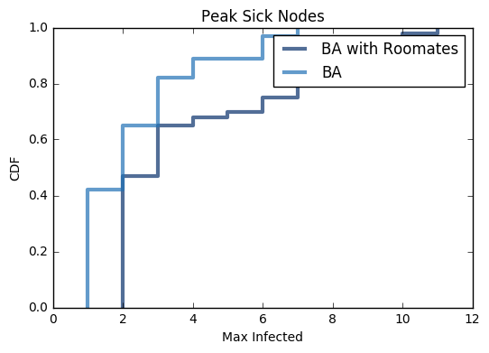
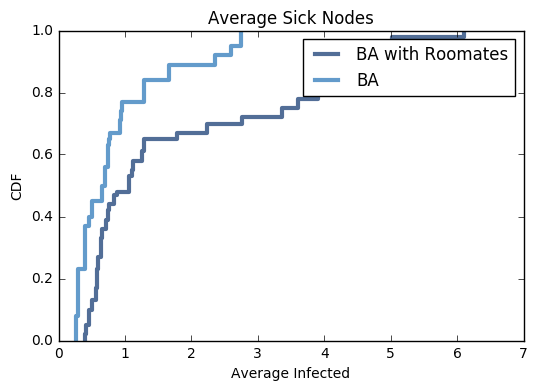
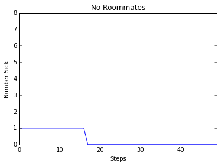
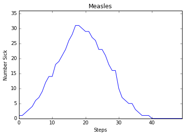
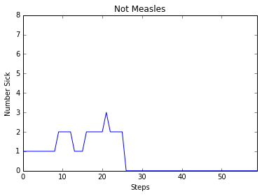
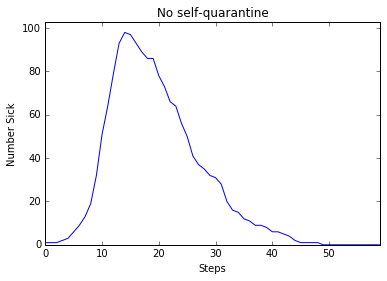
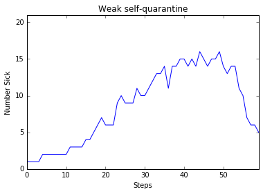
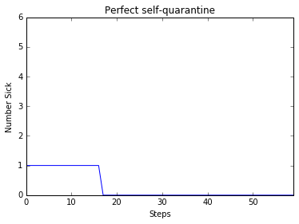

#Final Report Draft

##Freshman Plague
###An Epidemiological Story
Starring: Matthew Ruehle, Sean Carter, and Gabriel Butterick

##Abstract
We are investigating the spread of the Freshman plague through the student population. To do this, we use a Python implementation of BA graphs to represent the population, the edges of the graph to represent social relationships, and the effect of "infectious but unaware" time periods. In an attempt to make the model sufficiently realistic, we customize the social relationships to reflect roommate pairs as well as varying degrees of closeness among friends. We use the "infectious but unaware" time to emulate the way people sequester themselves once they know they're sick in order to observe the effect on disease spread.

##Experiments Performed

###1. Our first experiment was created to differentiate the spread of disease through a college campus from the spread of disease elsewhere. Our starting point was a Barabasi-Albert graph, which is already created to model a social network.

Question: Do stronger social relationships change the rate of disease spread?

Methodology: We generate a BA graph and modify it so that each node is a student object, with the ability to spread disease, the ability to resist disease, and a state (healthy, infected, or immune). We decide that infection should be spread by prolonged exposure - each timestep, a person can be given infection by nearby nodes that are infected, until they pass a threshold that labels them as infected as well.

We then generate another graph that has its edges set between random pairs of nodes to a maximum social bond (to simulate random roomate assignment in freshman year), and compare the results we obtain from otherwise random graphs.

Results:

Ovserved trends over 100 runs:

Infection durring a single run:

Interpretation: Both the total and peak number of infected nodes are greater in the graph with roommates. This can be partly attributed to the larger exposure level to the roommate - but, moreso the "small world" effect of ties between random nodes in a BA graph - increasing the odds of an early infection reaching a "popular" node.

###Question: How is disease spread affected by the interplay between self-quarantining, and an asymptomatic-but-virulently-infectious stage?

Methodology: By looking into the dynamics behind the real-world disease measles - containing, among other things, several days of heightened infectiousness but minimal symptoms - and considering the self-quarantining which most people display while ill (staying home, avoiding additional social engagements, &c.), we wrote a version of the disease which would change its infectiousness over time.

Results:
'Measles' vs 'Non-measles' infection dynamic, one run:

Quarantine strength, one run:

Quarantine strength, CDF of 100 runs:
_TODO. Will run and put here by the final report._

Interpretation: Increasing the virulence of the disease, as expected, also sharply increases both the peak and the mean number of infected nodes. We further observed that the strength of the self-imposed quarantine plays a significant role - as one would expect - in how quickly the disease manages to spread.
We speculate that part of the virulence of the "Freshman Plague" in particular can be attributed to the weakness of students' self-quarantines, especially in their first year. A strong or perfect quarantine, after all, leads to diseases which "die out" after just a few steps; unfortunately, a plethora of obligations (meeting new people, joining new activities, and coursework) keep even particularly sick students from achieving an effective self-imposed quarantine; this could explain some of why the plague also appears to manifest itself chiefly in the new class each year.

##Annotated Bibliography
Lander Willem et. al. "Optimizing Agent Based Models for Infectious Diseases"

Downloaded from http://bmcbioinformatics.biomedcentral.com/articles/10.1186/s12859-015-0612-2 (Links to an external site.) 9-27-16

The purpose of this paper is to examine optimization avenues available to agent based models of infectious disease transmission. The bulk of the paper revolves around describing the models, the optimizations for the models, and the resulting efficiency gains of the optimization. A more promising optimization they pursued was in clustering agents based on state and selectively performing calculations in order to avoid needless computation.

Cindy Hui, Mark Goldberg, Malik Magdon-Ismail, William A. Wallace: Simulating the Diffusion of Information: An Agent-based Modeling Approach

Link: http://www.cs.rpi.edu/~goldberg/publications/ads-journal.pdf 

This paper investigates the way that the preferences of agents can allow information about evacuation warnings to spread throughout a social network. It used variations of trust distribution, strategy for seeding the information, to explore the diffusion process.

Miksch, Urach, Einzinger, Zauner, "A Flexible Agent-Based Framework for Infectious Disease Modeling"

2014, University of the Philippines Cebu & Vienna Institute of Technology.  http://link.springer.com/chapter/10.1007%2F978-3-642-55032-4_4 (Links to an external site.)

An agent-based model provides a reasonable approximation of infectious diseases' spreads; epidemic behavior emerges naturally from a model with factors like an agent's susceptibility, health, and likelihood to spread the disease to other agents. The chief concern, then, is that these models require extensive "background" information: these parameters, for example, are difficult to measure, but the efficacy of the model in predicting real-world behavior rely on knowing them for a human population.