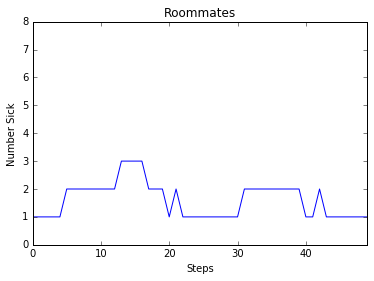

#Preliminary Report

##Freshman Plague
###An Epidemiological Story
Starring: Matthew Ruehle, Sean Carter, and Gabriel Butterick

##Abstract
We plan to investigate infectious disease spread through a network of socially and spacially connected nodes. The nodes will be agents, in so much as they will interact and maintain randomly generated, unique characteristics. We want to examine the way characteristics affect the spread of disease, what characteristics contribute to contracting disease, and what distributions of characteristics lead to the population being all sick or all well by the end.

##Annotated Bibliography
Lander Willem et. al. "Optimizing Agent Based Models for Infectious Diseases"

Downloaded from http://bmcbioinformatics.biomedcentral.com/articles/10.1186/s12859-015-0612-2 (Links to an external site.) 9-27-16

The purpose of this paper is to examine optimization avenues available to agent based models of infectious disease transmission. The bulk of the paper revolves around describing the models, the optimizations for the models, and the resulting efficiency gains of the optimization. A more promising optimization they pursued was in clustering agents based on state and selectively performing calculations in order to avoid needless computation.

Cindy Hui, Mark Goldberg, Malik Magdon-Ismail, William A. Wallace: Simulating the Diffusion of Information: An Agent-based Modeling Approach

Link: http://www.cs.rpi.edu/~goldberg/publications/ads-journal.pdf 

This paper investigates the way that the preferences of agents can allow information about evacuation warnings to spread throughout a social network. It used variations of trust distribution, strategy for seeding the information, to explore the diffusion process.

Miksch, Urach, Einzinger, Zauner, "A Flexible Agent-Based Framework for Infectious Disease Modeling"

2014, University of the Philippines Cebu & Vienna Institute of Technology.  http://link.springer.com/chapter/10.1007%2F978-3-642-55032-4_4 (Links to an external site.)

An agent-based model provides a reasonable approximation of infectious diseases' spreads; epidemic behavior emerges naturally from a model with factors like an agent's susceptibility, health, and likelihood to spread the disease to other agents. The chief concern, then, is that these models require extensive "background" information: these parameters, for example, are difficult to measure, but the efficacy of the model in predicting real-world behavior rely on knowing them for a human population.

 

##Original Experimental Ideas
1. Take an existing model, like one of those used in the Lander Willem paper, and try an optimization not included in their paper. This would give us a basic starting point for a model that we didn't have to generate ourselves that we could then try and make faster. Our results for this would be graphs modeling the time/space requirements for various attempted optimizations versus the original implementation. If we could accomplish optimizations in either time or space in such a way that there wasn't a large increase in requirment of the other (less space more time and vice versa), we would consider the project a success.

2. Using the Hui paper and its model for simulating the diffusion of information, we could generate a basic model for disease transmission. The proposed model in the paper uses strength of connections, or "trust", to determine how fast information spreads. If we took that connection model and changed it to disease transmission, we would have disease spreading better accross some connections than others. We would use this to simulate roomate pairs or strong friendships to demonstrate the increased contact between those agents and the increased likelihood of disease transmission. We want to have a network diagram represent the state of the system at the beginning and end of the system in an effort to show the effect of social connection on disease spread. We want to represent the intermediate period of the model running via animating a cellular automata based off the social network. We want to show trends in characteristics over time, rate of sickness growth dependent on characteristic concentration, and any other important traits.

##Experiments Performed
1. We began to implement the first experiment by creating a Barabási–Albert graph with randomly varying the strength of the connections between nodes - this was to simulate the environment that a desease spreads in. While implimenting this, we realized that having roomates as very strong bonds could change how quickly disease spreads. 

Question: How does adding very strong random roomate edges to a BA graph change the speed with which disease propogates through our network, and how does this change the maximum number of people that become infected?

Methodology: We generated a BA graph based on the model from chapter 4 in ThinkComplexity. We modified it so that each node is a students object, with an ability to spread disease, an ability to resist disease, and a state (healthy, infected, or immune). We decided that infectio should be spread by prolonged exposure - each timestep, a person can be given infection by nearby nodes that are infected, untill they pass a threshold that lables them as infected as well.

After this, we implemented another function that would set edges between pairs of nodes to a maximum social bond at random (to simulate random roomate assignment in freshman year), and compared the results obtained from otherwise random graphs.

Results: 

Interpretation: As one might expect, both the total and peak number of infected nodes is greater in the graph with roommates. This can be partly attributed to just the exposure of the roommate - but, moreso the "small world" effect of ties between random nodes in a BA graph - increasing the odds of an early infection reaching a "popular" node.

2. For an additional experiment, we hope to look at the impacts of quarantining - coupled with a more infectious (and ideally, more realistic) virus. For example - if, once the disease displays symptoms, infections drop - but, we divide the disease into an asymptomatic-infectious and symptomatic-infectious stage, like what is observed in nature, then quarantining those with symptoms could conceivably provide a more realistic model.

Question: How does the spread of an infectious agent through a network change as a result of quarantining "sick" nodes, after an infectious-but-invisible stage?

Methodology: We will generate a social BA graph (likely, with roommate pairs), and then infect a random agent. The disease will now have two "thresholds" - an exposure, until the disease is communicable, and a timer, until the disease is visible (after reaching the exposure threshold).

Interpretation: We will compare the rate of infection, the total number of infected nodes, and the peak infection for an environment with and without quarantine, as well as for a "weak" quarantine (e.g., reduced--but not eliminated--interaction between symptomatic and healthy nodes).

3. As an additional measure for our project, we plan to alter the infectious "step" and the agent parameters (as well as the BA graph generation) to produce a more realistic representation of infection in a social network. This will likely involve trying to make the agents more realistic, and the behavior of the disease more biologically accurate - e.g., by adding in more triangles and complete subgraphs in generation, and more closely imitating the observed behavior of viruses in general.

##Learning Goals
Matt: I'd like to learn about simulating networks, and about using models in a concrete, explanatory/predictive context. If I could pick up a bit about efficient computational modeling, that would be cool too.

Gabe: My main learning goal is to explore the boundaries of reasonable cellular automata. How complicated can we make the model while still having it function quickly? I also want to become more familiar with complex cellular automata and how they work. I'd like to learn more about model efficiency diagnostic methods, for future use in making sure the models I'm involved are effective.

Sean: To me, the most important thing is learning to impliment a reasonable model in Python without the guidance of the textbook. I also want to make pretty graphs (i.e. learn more about visualization), and it seems like this project will offer a pretty big coding challenge. There are also many different factors in the results of a disease model that are important, which means that there is a lot of room to create an interesting visualization.